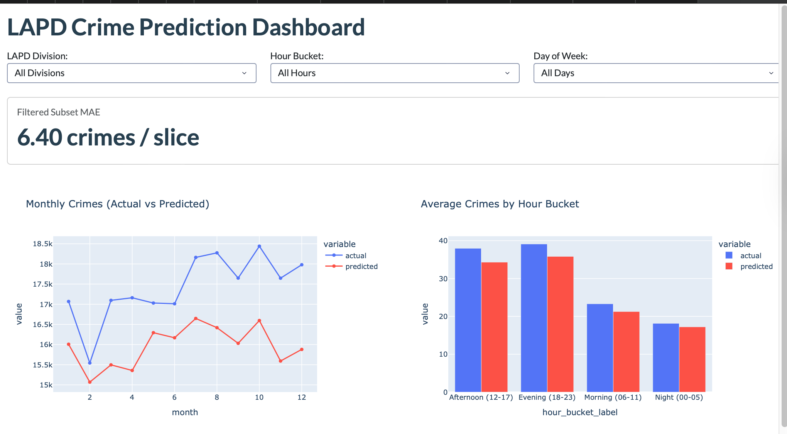
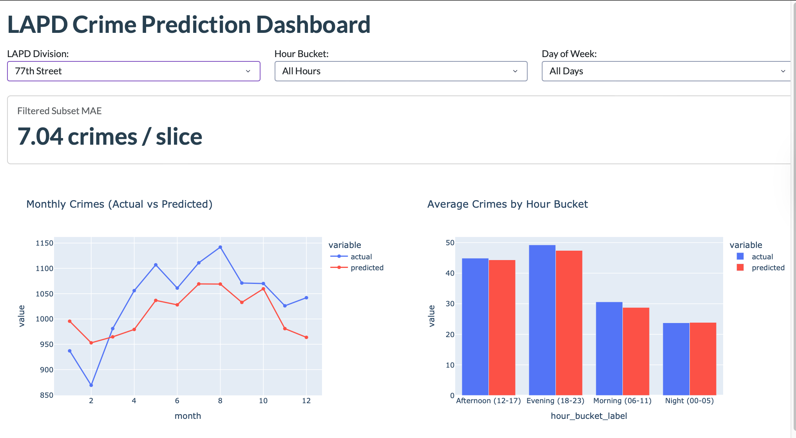

# LAPD Crime Analytics & Predictive Pipeline

[](https://lapd-crime-dashboard.onrender.com/)


An end-to-end data engineering and predictive modeling project analyzing **~1 million LAPD crime records (2020-2024)**. It covers data cleaning and feature engineering with PySpark, an XGBoost regression model evaluated against two baselines, and an interactive Dash dashboard deployed on Render.

> **Note**: The dashboard is hosted on Render's free tier. If it has been inactive, the server sleeps and the first load can take up to **50-60 seconds**. After that, interactions are instant.





---

## Executive Summary

* **Data volume**: Ingested **1,004,847** raw incident records from Kaggle via `kagglehub`.
* **Cleaning and filtering**: Removed **102,792** non-physical crime entries (e.g., identity theft, fraud) to retain **902,055** physical crime events. PySpark row counts were cross-validated against Pandas.
* **Feature engineering**: Created `year`, `month`, `day_of_week`, `is_weekend`, and 6-hour `hour_bucket` features.
* **Model performance**: The XGBoost regressor achieved a **6.40 MAE** (crimes per slice) on 2023 test data, **36.89%** lower than Baseline 1 and **17.21%** lower than Baseline 2.
* **Deployment**: Hosted as a **Dash & Plotly** web service on **Render** (free tier), served via Gunicorn.

---

## Model Evaluation Results

Time-based split: trained on 2020-2022, tested on 2023 (7,056 division/time slices, mean actual crime count: **29.63**).

| Model / Baseline | MAE | MAE (% of Mean Actual) | Improvement vs. Baseline 1 | Improvement vs. Baseline 2 |
| :--- | :---: | :---: | :---: | :---: |
| **Baseline 1 (Division Mean)** | 10.13 | 34.20% | Benchmark | - |
| **Baseline 2 (Previous Year)** | 7.73 | 26.07% | +23.77% | Benchmark |
| **XGBoost Regressor** | **6.40** | **21.59%** | **+36.89%** | **+17.21%** |

---

## Limitations

* **Under-prediction bias**: On 2023 data the model predicts lower than actual counts on average (mean error: **[X.XX]** crimes per slice). [Add your confirmed explanation here, e.g. 2023 volume compared with the 2020-2022 training mean.]
* **Coarse target**: Each row is a crime count per division, month, weekday and 6-hour block. It is not a daily or per-incident prediction.
* **Limited features**: Calendar and division-level features only; no weather, local events or location within a division.
* **Incomplete final year**: [Confirm against model.py: 2024 data is partial and is excluded from training and evaluation.]

---

## Run Locally

```bash
pip install -r requirements.txt
python app.py        # dashboard at http://localhost:8050
```

ETL and model training require PySpark and XGBoost. See `etl.py`, `model.py` and the notebooks.

---

## Project Structure

```text
.
|-- tests/
|   `-- test_etl.py                     # PySpark transformation and parsing unit tests
|-- .gitignore                          # Excludes raw data, parquet outputs and pickles
|-- 01_eda_and_feature_engineering.ipynb
|-- 02_pyspark_modeling.ipynb
|-- app.py                              # Production Dash web application (Flask server)
|-- dashboard_overview.png              # README screenshot
|-- dashboard_filtered.png              # README screenshot
|-- etl.py                              # PySpark ETL and spatial-temporal aggregation
|-- model.py                            # XGBoost regressor, baseline evaluation, CSV export
|-- predictions_2023.csv                # Pre-computed model outputs for the dashboard
|-- README.md
`-- requirements.txt                    # Production Python dependencies
```

---

## Data Source

LAPD "Crime Data from 2020 to Present," obtained from Kaggle via `kagglehub`. Raw data is not included in this repository.
